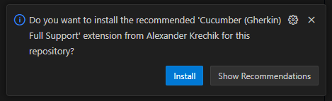
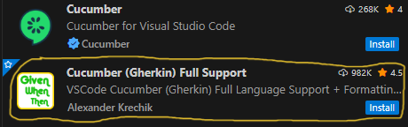
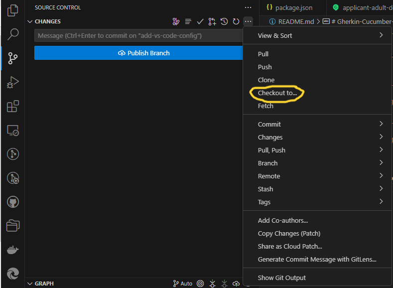
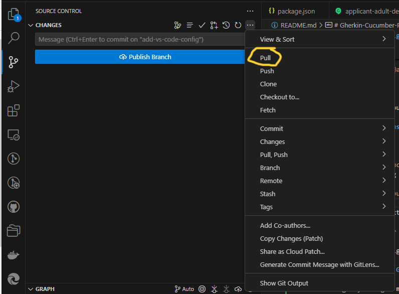
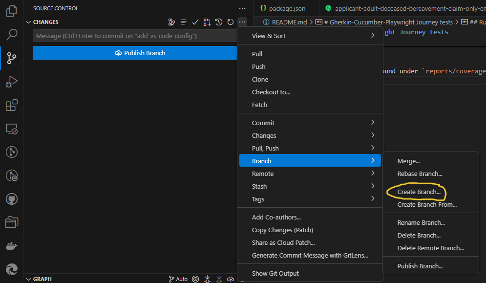
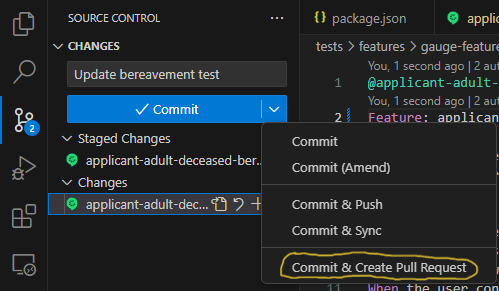
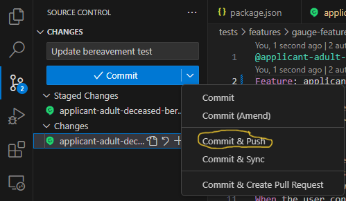

# Gherkin-Cucumber-Playwright Journey tests

## Getting started

Read the docs [Cucumber-js](https://github.com/cucumber/cucumber-js/blob/main/docs/installation.md)

Configuration for the cucumber test runner is found in

-   `../cucumber.json`

Secrets for one login authentication tests in the browser must be provided in `./env/default/tests.secrets.js`

## Run the scripts

The scripts will run against the target specified in `../cucumber.json`: `router`, `dcs` or `cw`. When running against the browser screenshots can be saved to `./reports/cucumber` by modifying the `screenshotRegistry` array in `./tests/features/step_definitions/cwStepFunctions`. When running against the router ensure `npm run build` has been run first so the tests use the up to date version of the template. An email address and phone number for receiving confirmation messages should be provided in `../cucumber.json`.

### Legacy tests

To run all tests that represent a full journey use `npx cucumber-js --tags="@legacy"`. Further tests for authentication and postcode lookup can be run using `npx cucumber-js --tags="@postcode-lookup or @authentication"`. Coverage of all template sections can be reached by running `npx cucumber-js --tags="@legacy or @coverage or @injury"`.

### WIP: New test format

Scenarios use tags to plot their journey. Each tag is either a role (which will take a happy path through the app),
a specific section of the application or a cucumber hook reference.

To run the `applicant:adult:self.deceased` journey, run the following command:

`npx cucumber-js --tags="@applicant:adult:self.deceased"`

To run the `applicant:adult:self.deceased` journey and also test the residency and nationality flow, run the following command:

`npx cucumber-js --tags="@applicant:adult:self.deceased or @residency or @back"`

### Reports

Coverage reports can be found under `reports/templateCoverage/`. A separate folder will be generated for each target the tests are run against.
To verify the output datasets are unchanged set the `compareFixtures` variable to `true` in `cucumber.json` and run `npm run test:features:full` against the router.
To update the fixtures (when there is a required change in the data output), first delete `reports/fixtures/fullFixture.json` and then repeat the above with the `saveFixtures` variable set to `true` in `cucumber.json`. Once the tests have been run move the new `fullFixture.json` from `reports/fixtures/temp` into `report/fixtures`.
To run a check against a subset of the tests' outputs set the `savefixtures` variable to `true` and the `fullFixtureComparison` variable to `false`. This will generate a `partialFixture.json` file in `reports/fixtures/temp`. Move this file into `report/fixtures` before running the test again to compare the outputs.

## Editing feature files using VS Code and Git

### Local VS Code setup

We recommend using the [Cucumber (Gherkin) Full Support extension for VS Code](https://marketplace.visualstudio.com/items?itemName=alexkrechik.cucumberautocomplete). Upon downing the repository and opening it for the first time in VS code a prompt should appear to install recommended extensions in the bottom right of the screen:

Alternatively, open the extensions panel, search for Cucumber and install 'Cucumber (Gherkin) Full Support':

This extension highlights mistyped steps and provides auto-complete when writing new steps.

### Editing files and committing changes to Github

If editing locally, first open the git folder in VS Code. This can be done by opening VS Code and selecting "File > Open Folder..."

Before making any changes make sure you have the latest version of everything. To do this open the source control panel, click the three dots in the top right and select "Checkout to...". Select "Main" from the list that appears.

Then, click the same three dots and select "Pull".

These two steps ensure you have the latest versions of all the files. Once this has been done you can create a new branch. This allows you to edit the files without changing their main version. To do this, click the three dots in the source control panel and select "Branch > Create Branch...".

A textbox will appear where you can name your branch. Branch names should be all lower case with no spaces in them, e.g. example-branch. Once your branch has been created you can edit any files.

After editing and saving the desired files open the source control panel in VS code. A list of edited files will appear. Click the + icon next to the files you want to commit and they will be marked as staged changes. Add a message to the textbox at the top and click the drop down arrow next to the commit button. Select "Commit & Create Pull Request" and the branch will be pushed up to github where it can be reviewed and merged.

If you wish to make any more changes after creating the pull request, repeat the above to add the changes but select "Commit & Push" instead. This will push the new changes to the existing pull request.

